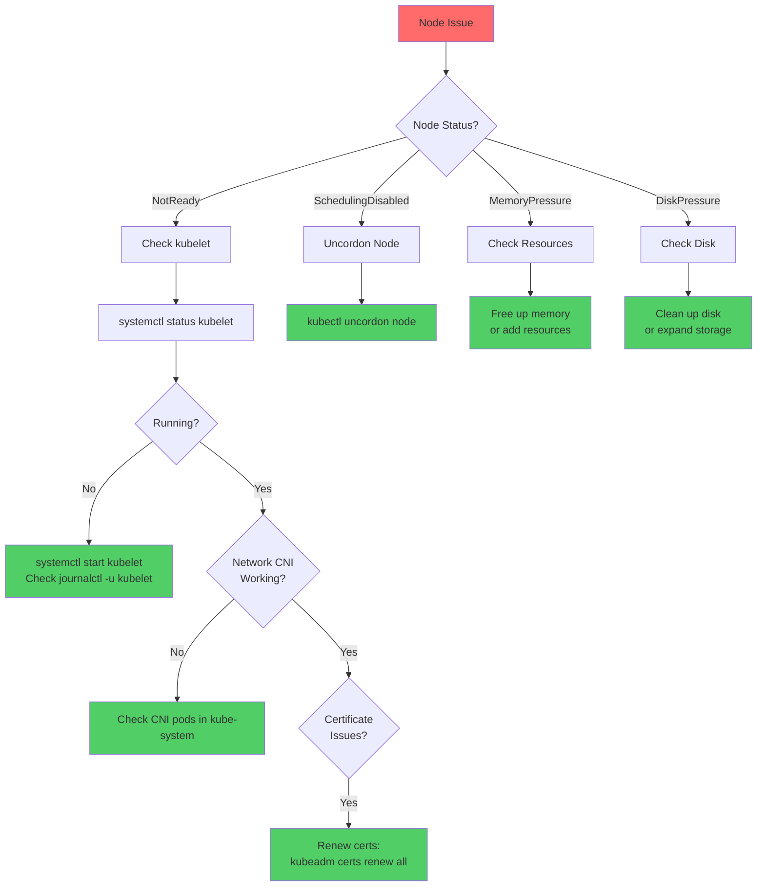
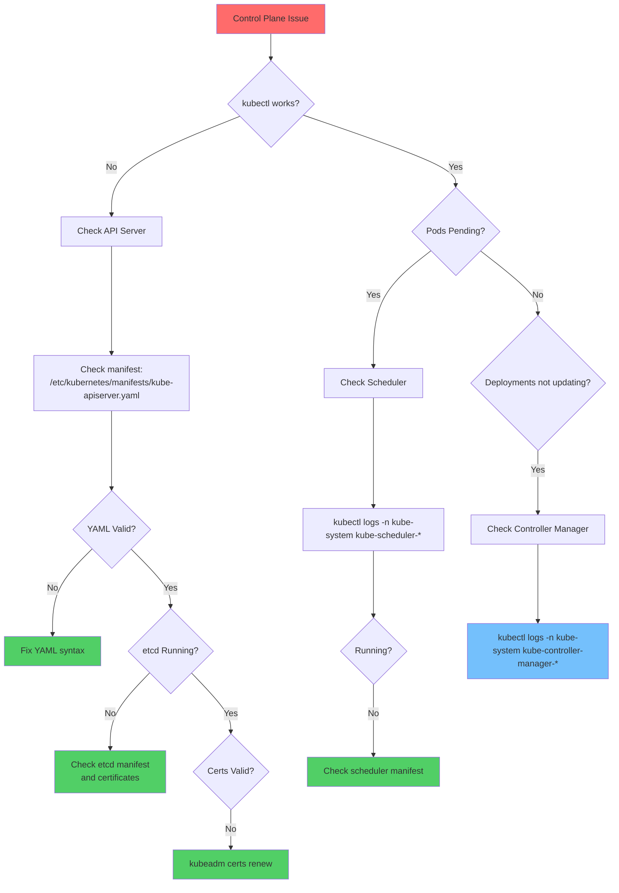
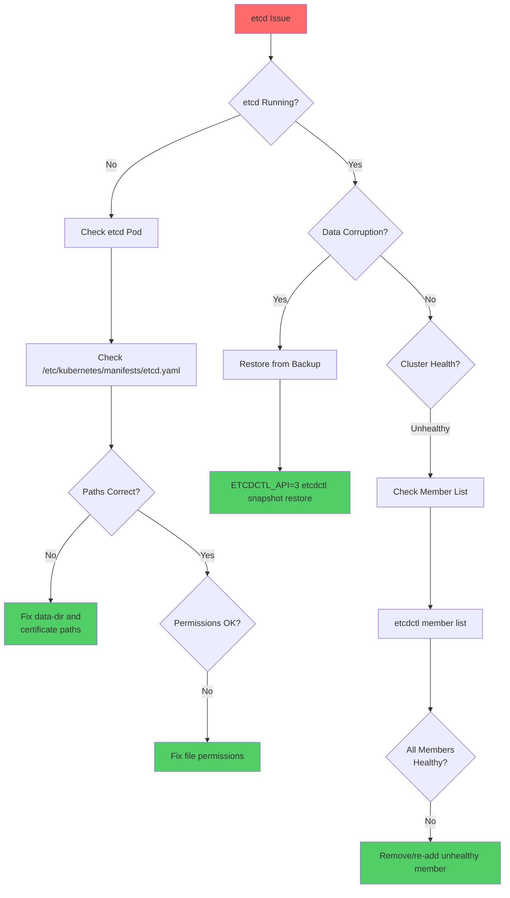
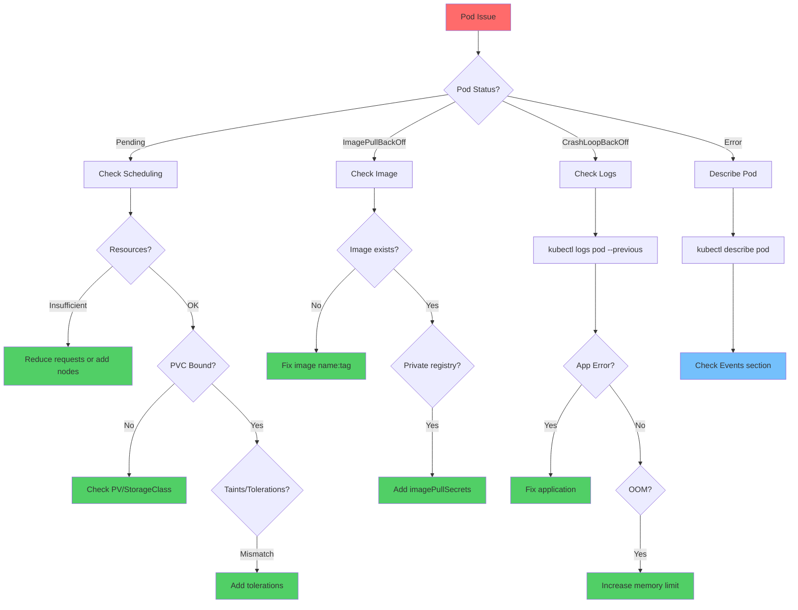
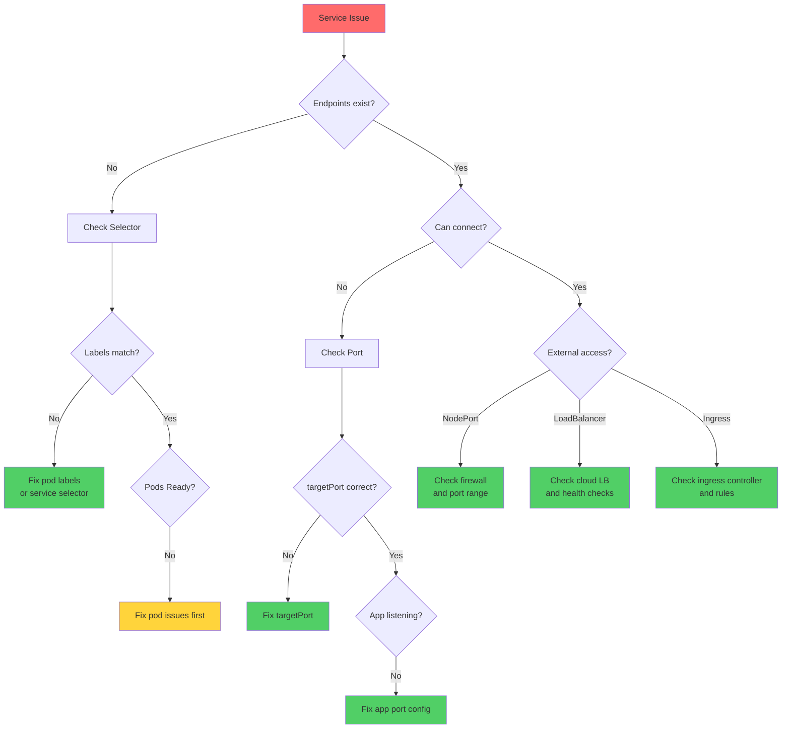

# CKA Troubleshooting Flowcharts

## Cluster / Node Troubleshooting

---

## Control Plane Troubleshooting

---

## etcd Troubleshooting

---

## Pod Troubleshooting

---

## Service Troubleshooting

---

## Quick Diagnostic Commands

| Issue | Command |
|-------|---------|
| **Node status** | `kubectl get nodes -o wide` |
| **Node describe** | `kubectl describe node <node>` |
| **kubelet logs** | `journalctl -u kubelet -f` |
| **API server logs** | `kubectl logs -n kube-system kube-apiserver-*` |
| **etcd health** | `ETCDCTL_API=3 etcdctl endpoint health` |
| **Pod events** | `kubectl describe pod <pod>` |
| **Pod logs** | `kubectl logs <pod> --previous` |
| **Service endpoints** | `kubectl get endpoints <svc>` |
| **All events** | `kubectl get events --sort-by='.lastTimestamp'` |
| **Component status** | `kubectl get pods -n kube-system` |
