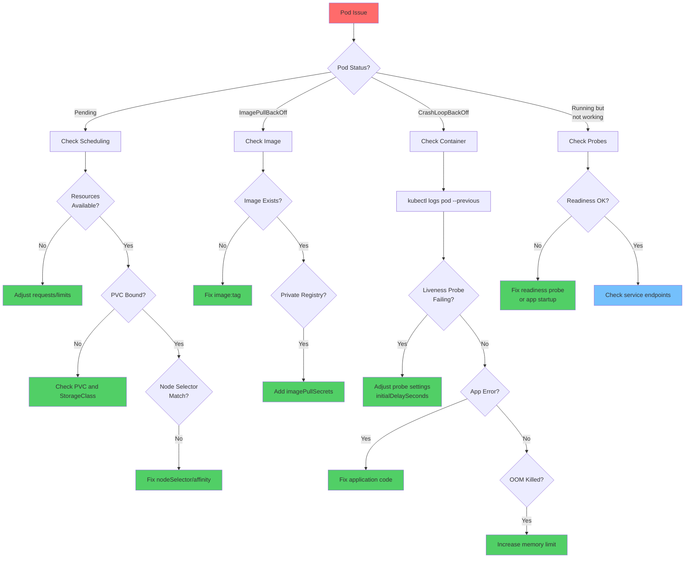
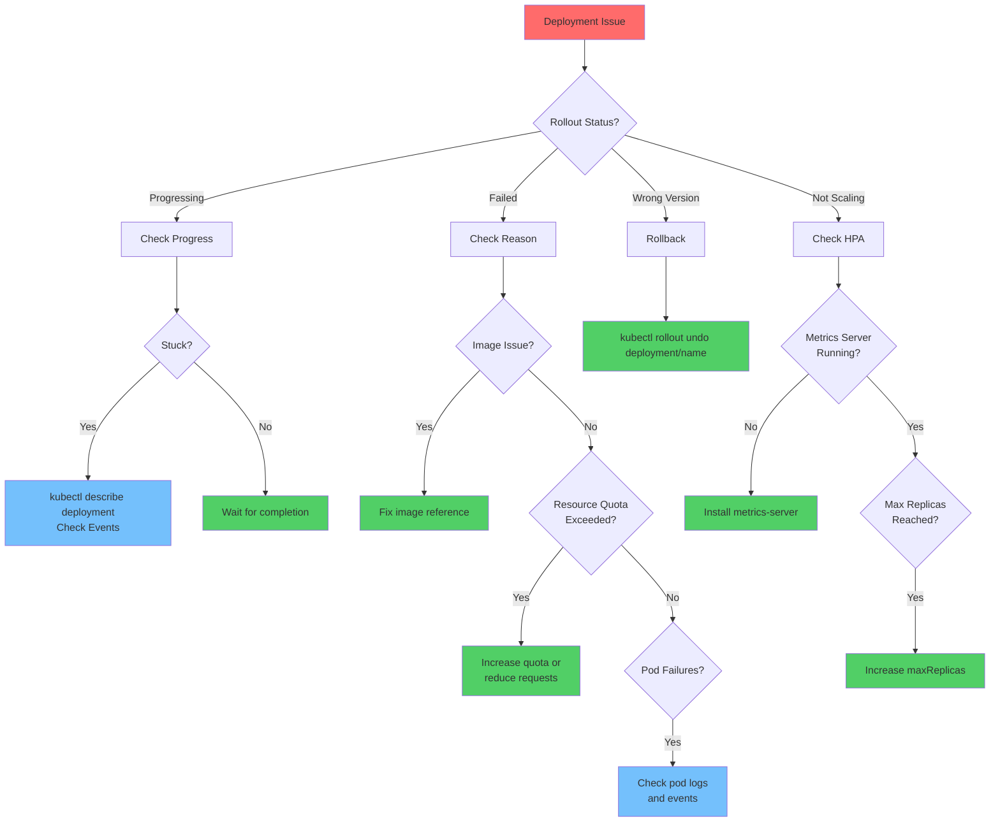
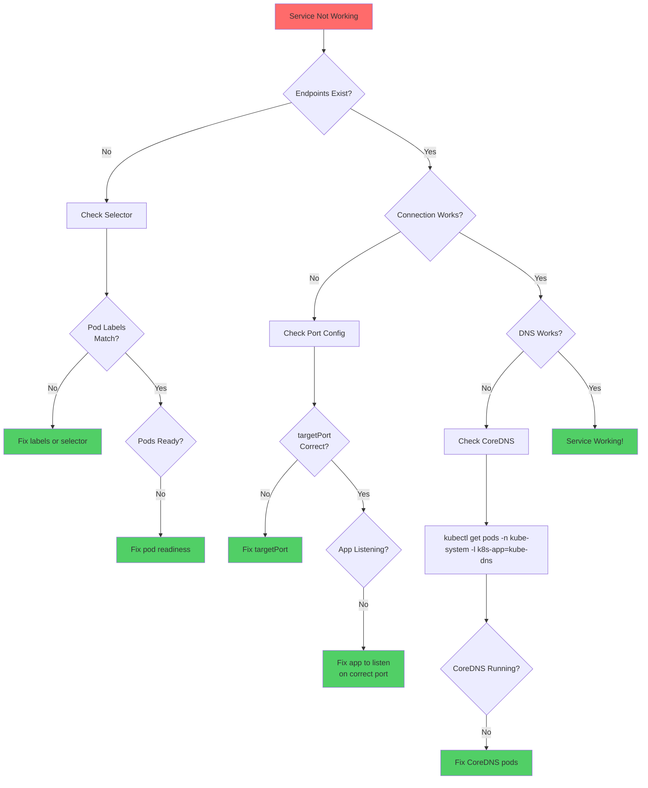
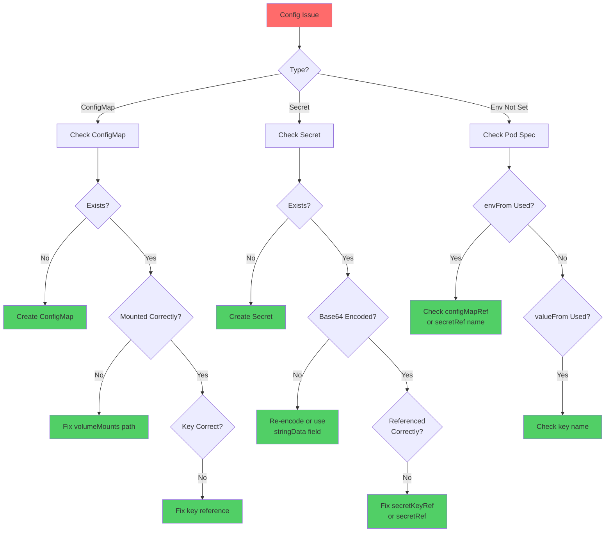
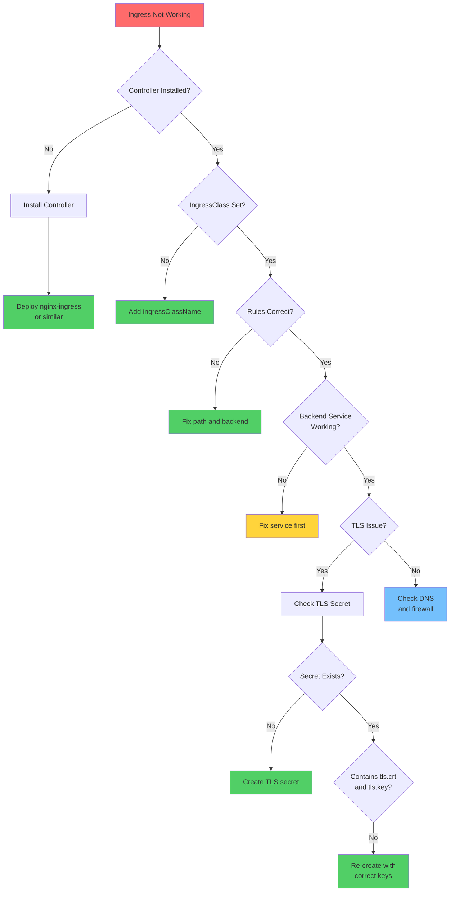

# CKAD Troubleshooting Flowcharts

## Pod Troubleshooting

---

## Deployment Troubleshooting

---

## Service Troubleshooting

---

## ConfigMap/Secret Troubleshooting

---

## Ingress Troubleshooting

---

## Quick Debug Commands

| Issue | Command |
|-------|---------|
| **Pod status** | `kubectl get pod <pod> -o wide` |
| **Pod describe** | `kubectl describe pod <pod>` |
| **Pod logs** | `kubectl logs <pod> -c <container>` |
| **Previous logs** | `kubectl logs <pod> --previous` |
| **Exec into pod** | `kubectl exec -it <pod> -- sh` |
| **Port forward** | `kubectl port-forward <pod> 8080:80` |
| **Service endpoints** | `kubectl get endpoints <svc>` |
| **Test DNS** | `kubectl run test --rm -it --image=busybox -- nslookup <svc>` |
| **Test HTTP** | `kubectl run test --rm -it --image=busybox -- wget -O- <svc>` |
| **Rollout status** | `kubectl rollout status deployment/<name>` |
