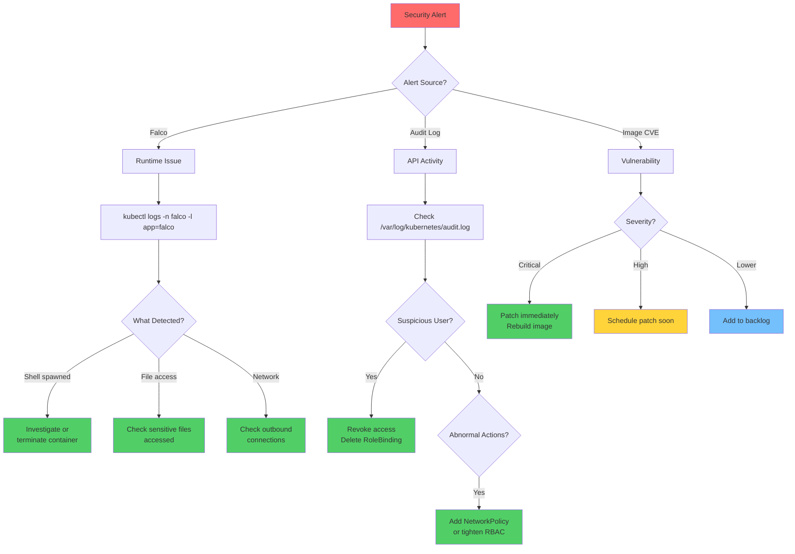
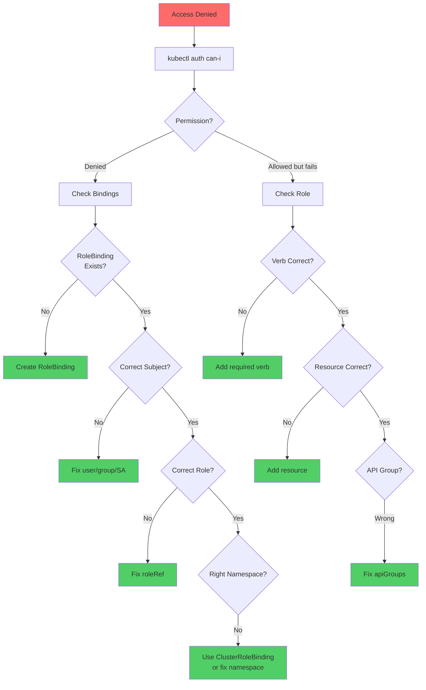
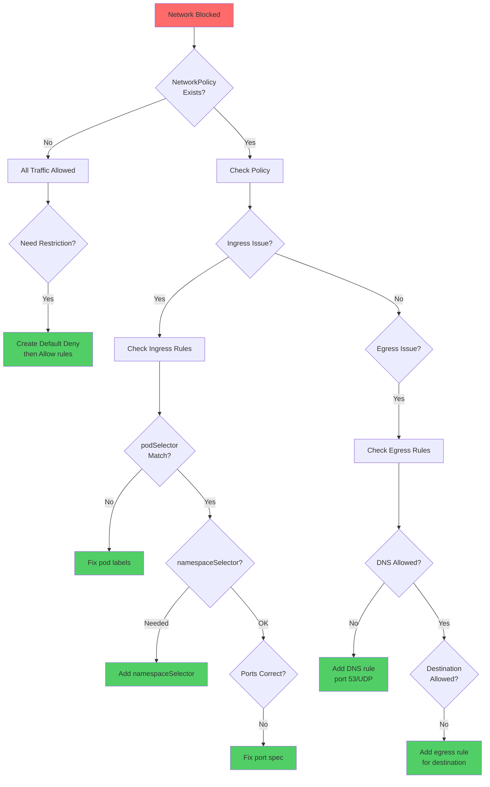
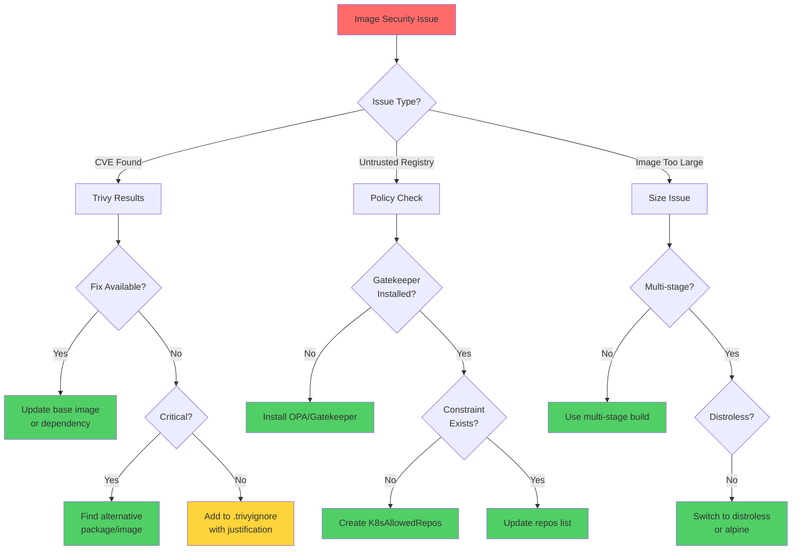
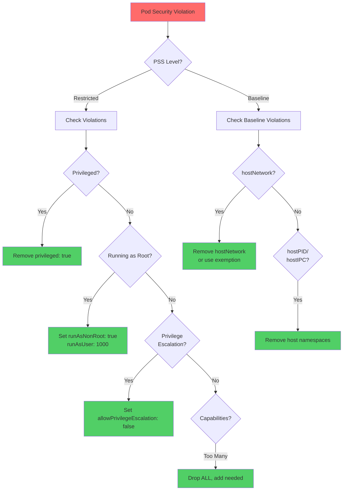

# CKS Security Troubleshooting Flowcharts

## Security Incident Response

---

## RBAC Troubleshooting

---

## NetworkPolicy Troubleshooting

---

## Image Security Troubleshooting

---

## Pod Security Troubleshooting

---

## Quick Security Commands

| Check | Command |
|-------|---------|
| **RBAC test** | `kubectl auth can-i create pods --as <user>` |
| **List permissions** | `kubectl auth can-i --list --as <user>` |
| **Find cluster-admin** | `kubectl get clusterrolebindings -o json \| jq '.items[] \| select(.roleRef.name=="cluster-admin")'` |
| **Scan image** | `trivy image --severity HIGH,CRITICAL <image>` |
| **Falco logs** | `kubectl logs -n falco -l app=falco -f` |
| **Audit logs** | `cat /var/log/kubernetes/audit.log \| jq` |
| **Secret access** | `kubectl auth can-i get secrets --as <user>` |
| **Check PSS** | `kubectl get ns --show-labels` |
| **NetworkPolicies** | `kubectl get networkpolicy -A` |
| **kube-bench** | `kube-bench run --targets master` |
| **AppArmor status** | `aa-status` |
